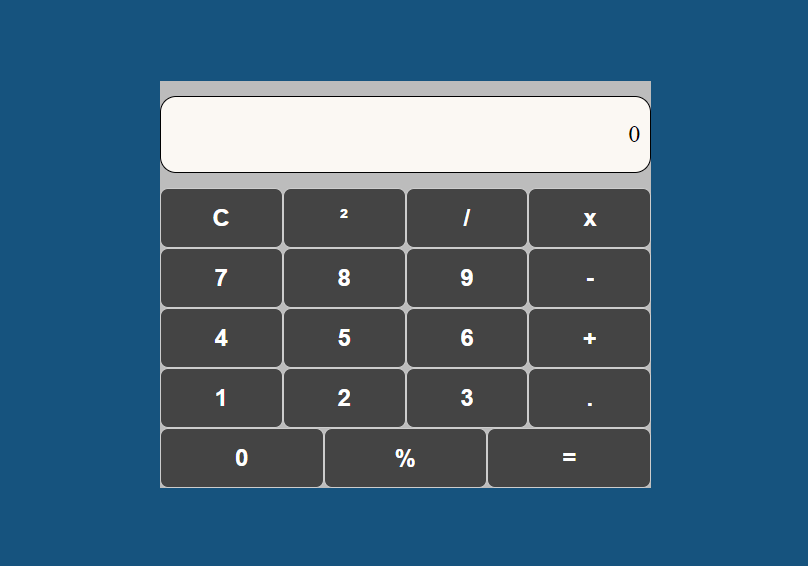

<h1 align="center">Calculadora</h1>

Projeto de uma calculadora básica, utilizando conceitos aprendizados no primeiro modulo da formação de React.  

  <a href="#-tecnologias">Tecnologias</a>&nbsp;&nbsp;&nbsp;|&nbsp;&nbsp;&nbsp;
  <a href="#-projeto">Projeto</a>&nbsp;&nbsp;&nbsp;|&nbsp;&nbsp;&nbsp;
  <a href="#-layout">Layout</a>&nbsp;&nbsp;&nbsp;|&nbsp;&nbsp;&nbsp;
  <a href="#-aprendizado">Aprendizado</a>&nbsp;&nbsp;&nbsp;|&nbsp;&nbsp;&nbsp;
  <a href="#memo-licença">Licença</a>

  

 

  

---
## 🚀 Tecnologias

Esse projeto foi desenvolvido com as seguintes tecnologias:

- HTML e CSS
- JavaScript
- React
- Git e Github

---
## 💻 Projeto

O Projeto da calculadora, serve para realizar operações matemáticas cotidianas, como adição, subtração, divisão e multiplicação.

<!--[Acesse o projeto em andamento, online](https://Gustavo-Zamai.github.io/Pokedex)-->

---

## 🔖 Layout

Esse projeto não teve layout disponibilizado previamente, ele foi desenvolvido como exercício de fixação do primeiro modulo.

---

## 📑 Aprendizado

---
## 📝 Licença

Esse projeto está sob a licença MIT.

---

Feito com ♥ por Gustavo Zamai
